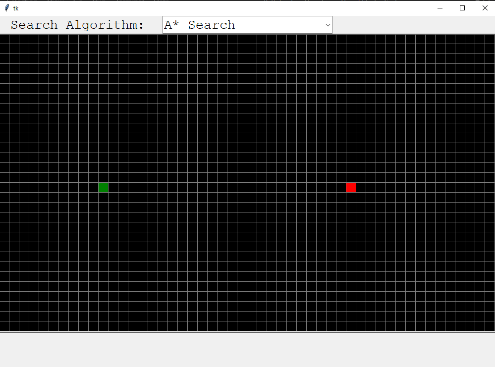

# Path Finding Visualizer

<h2>Introduction</h2>
This is a software that visualizes how a computer finds the shortest path from the start position to the end position in a maze using various search algorithms.
I built this software to implement the search algorithms I learnt from taking <a href="https://cs50.harvard.edu/ai/2020/">Harvard's CS50 AI course</a>.

 

<h2>About</h2>
The visualizations were made with a simple tkinter canvas. The actual process of the finding the path were done with these search algoritms

<ul>
    <li><a href="https://en.wikipedia.org/wiki/Depth-first_search">Depth First Search</a></li>
    <li><a href="https://en.wikipedia.org/wiki/Breadth-first_search">Breadth First Search</a></li>
    <li><a href="https://en.wikipedia.org/wiki/Best-first_search">Greedy Best First Search</a></li>
    <li><a href="https://en.wikipedia.org/wiki/A*_search_algorithm">A* Search</a></li>
</ul>

 

<h2>How to use</h2>

<b>Requirements</b>
- python 3.x

It starts on an empty 30 by 50 maze.
- The green box represents the start position. You can change it by clicking on it.

- The red box represents the goal position. You can change it by clicking on it.

- To draw obstacles click on an empty area anywhere on the maze, move mouse around to draw obstacles(represented by white) then click again to stop drawing.

- To erase obstacles right click on an empty area anywhere on the maze, move mouse around to erase obstacles then click again to stop erasing.

- You can specify the algorithm to use by changing the drop down list at the top.

- Hit &lt;spacebar> to start the path finding.

- The pink boxes are the boxes that were explored when finding path and the yellow boxes trail is the path

- After its done hit &lt;backspace> to reset maze.

<video src="./assets/video.mp4" width="700" controls>

